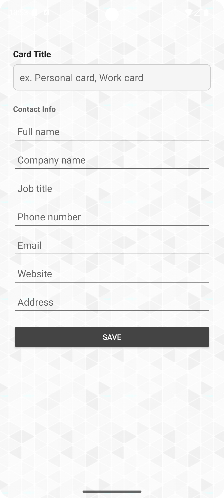

# Nokrap Card

<p align="left">
  
</p>

A no-BS Android app to create and share your digital business card (vCard) via QR code. 
Others can scan the QR code to **auto-compile all the info directly into their contacts**, 
so they just have to press save — no need to fill out annoying online forms that people 
usually skip.

- 100% free
- No ads
- No tracking
- No Signups
- Offline
- Simple, clean, and effective

## Features

- vCard input: 
  - Card title
  - Name & surname
  - Company name
  - Job title
  - Phone number
  - Email
  - Website
  - Address
- QR code generation
- Local storage
- Offline functionality

## Screenshots
<p align="left">
  
  
  
</p>

## Donations

If this project saved your sanity today, consider tossing a coffee my way!

<a href="https://www.buymeacoffee.com/nkro">
  
</a>

Slap a star on this if it tickled your fancy!

## License

### Source code

All source code is licensed under the GPL-3.0-only License.

```This program is free software: you can redistribute it and/or modify it under the terms of the GNU General Public License as published by the Free Software Foundation, version 3.```

Assets

All assets (images and audio files) are licensed under the CC-BY-SA 4.0 License.

This includes everything in the assets and media folders and in app/src/main/res.

Background Pattern by Dimitrie Hoekstra on Subtle Patterns (Toptal)
Source: [https://www.toptal.com/designers/subtlepatterns/gplay/](https://www.toptal.com/designers/subtlepatterns/gplay/)
